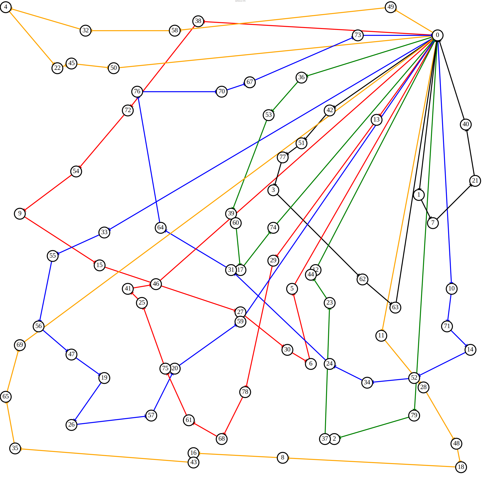

# Rapport Optimisation Discrète - Printemps 2018

### Étudiants
 - **JACOUD Bastien**
 - **REMOND Victor**
 
 <br>
 
 * Lien [dépôt GitHub C++ classique](https://github.com/Elomidas/CVRP)
 
 * Lien [dépôt GitHub Qt](https://github.com/Elomidas/CVRP-Qt)
 
 * Téléchargement [Version Stable C++ classique]() 
 
 * Téléchargement [Version Stable Qt]() 
 
 ![GraphExample1](data:image/svg+xml;base64,PD94bWwgdmVyc2lvbj0iMS4wIiBlbmNvZGluZz0iVVRGLTgiIHN0YW5kYWxvbmU9Im5vIj8+CjwhRE9DVFlQRSBzdmcgUFVCTElDICItLy9XM0MvL0RURCBTVkcgMS4xLy9FTiIKICJodHRwOi8vd3d3LnczLm9yZy9HcmFwaGljcy9TVkcvMS4xL0RURC9zdmcxMS5kdGQiPgo8IS0tIEdlbmVyYXRlZCBieSBncmFwaHZpeiB2ZXJzaW9uIDIuNDAuMSAoMjAxNjEyMjUuMDMwNCkKIC0tPgo8IS0tIFRpdGxlOiBnIFBhZ2VzOiAxIC0tPgo8c3ZnIHdpZHRoPSI1MDZwdCIgaGVpZ2h0PSIzNzhwdCIKIHZpZXdCb3g9IjAuMDAgMC4wMCA1MDUuODAgMzc4LjE3IiB4bWxucz0iaHR0cDovL3d3dy53My5vcmcvMjAwMC9zdmciIHhtbG5zOnhsaW5rPSJodHRwOi8vd3d3LnczLm9yZy8xOTk5L3hsaW5rIj4KPGcgaWQ9ImdyYXBoMCIgY2xhc3M9ImdyYXBoIiB0cmFuc2Zvcm09InNjYWxlKDEgMSkgcm90YXRlKDApIHRyYW5zbGF0ZSg0IDM3NC4xNzQ4KSI+Cjx0aXRsZT5nPC90aXRsZT4KPHBvbHlnb24gZmlsbD0iI2ZmZmZmZiIgc3Ryb2tlPSJ0cmFuc3BhcmVudCIgcG9pbnRzPSItNCw0IC00LC0zNzQuMTc0OCA1MDEuNzk4MywtMzc0LjE3NDggNTAxLjc5ODMsNCAtNCw0Ii8+Cjx0ZXh0IHRleHQtYW5jaG9yPSJtaWRkbGUiIHg9IjI0OC44OTkxIiB5PSItMzUzLjU3NDgiIGZvbnQtZmFtaWx5PSJUaW1lcyxzZXJpZiIgZm9udC1zaXplPSIxNC4wMCIgZmlsbD0iIzAwMDAwMCI+R3JhcGggZXhhbXBsZTwvdGV4dD4KPCEtLSAwJiM0NTsmZ3Q7MSAtLT4KPGcgaWQ9ImVkZ2UxIiBjbGFzcz0iZWRnZSI+Cjx0aXRsZT4wJiM0NTsmZ3Q7MTwvdGl0bGU+CjxwYXRoIGZpbGw9Im5vbmUiIHN0cm9rZT0iIzAwMDBmZiIgZD0iTTIxNS4yMjc4LC0yMTAuMTg5NEMyMTEuNTQsLTIyMC40NDA4IDIwNi43NzQ3LC0yMzMuNjg3MyAyMDIuNjAwMSwtMjQ1LjI5MTkiLz4KPHBvbHlnb24gZmlsbD0iIzAwMDBmZiIgc3Ryb2tlPSIjMDAwMGZmIiBwb2ludHM9IjE5OS4yMTcxLC0yNDQuMzU2MyAxOTkuMTI1NSwtMjU0Ljk1MDggMjA1LjgwMzksLTI0Ni43MjU5IDE5OS4yMTcxLC0yNDQuMzU2MyIvPgo8L2c+CjwhLS0gMCYjNDU7Jmd0OzE0IC0tPgo8ZyBpZD0iZWRnZTgiIGNsYXNzPSJlZGdlIj4KPHRpdGxlPjAmIzQ1OyZndDsxNDwvdGl0bGU+CjxwYXRoIGZpbGw9Im5vbmUiIHN0cm9rZT0iI2ZmMDAwMCIgZD0iTTIzNy43MTE1LC0yMDAuNjk1NUMyNDcuMTI3MSwtMjA1LjExMTYgMjU5LjIyODcsLTIxMC43ODc1IDI3MC4xMzk4LC0yMTUuOTA1MSIvPgo8cG9seWdvbiBmaWxsPSIjZmYwMDAwIiBzdHJva2U9IiNmZjAwMDAiIHBvaW50cz0iMjY4Ljc4NDUsLTIxOS4xMzUyIDI3OS4zMjQ0LC0yMjAuMjEyOCAyNzEuNzU3LC0yMTIuNzk3NyAyNjguNzg0NSwtMjE5LjEzNTIiLz4KPC9nPgo8IS0tIDEmIzQ1OyZndDsyIC0tPgo8ZyBpZD0iZWRnZTIiIGNsYXNzPSJlZGdlIj4KPHRpdGxlPjEmIzQ1OyZndDsyPC90aXRsZT4KPHBhdGggZmlsbD0ibm9uZSIgc3Ryb2tlPSIjMDAwMGZmIiBkPSJNMTc5LjY4MDMsLTI4NC42MTQ2QzE3Mi40MTcyLC0yOTEuNDc0MyAxNjMuMjYwNCwtMzAwLjEyMjUgMTU1LjA4NTQsLTMwNy44NDM2Ii8+Cjxwb2x5Z29uIGZpbGw9IiMwMDAwZmYiIHN0cm9rZT0iIzAwMDBmZiIgcG9pbnRzPSIxNTIuNTA4OSwtMzA1LjQ2MjcgMTQ3LjY0MiwtMzE0Ljg3MzUgMTU3LjMxNTQsLTMxMC41NTE3IDE1Mi41MDg5LC0zMDUuNDYyNyIvPgo8L2c+CjwhLS0gMyYjNDU7Jmd0OzQgLS0+CjxnIGlkPSJlZGdlNCIgY2xhc3M9ImVkZ2UiPgo8dGl0bGU+MyYjNDU7Jmd0OzQ8L3RpdGxlPgo8cGF0aCBmaWxsPSJub25lIiBzdHJva2U9IiMwMDAwZmYiIGQ9Ik00NS40Njc2LC0zMDUuNDA1OUM0MS4wNjEyLC0yOTYuNTIzMyAzNS41MDU5LC0yODUuMzI0NyAzMC41NDYxLC0yNzUuMzI2NiIvPgo8cG9seWdvbiBmaWxsPSIjMDAwMGZmIiBzdHJva2U9IiMwMDAwZmYiIHBvaW50cz0iMzMuNjA5OCwtMjczLjYyNjUgMjYuMDMwNCwtMjY2LjIyMzYgMjcuMzM5LC0yNzYuNzM3MyAzMy42MDk4LC0yNzMuNjI2NSIvPgo8L2c+CjwhLS0gMiYjNDU7Jmd0OzMgLS0+CjxnIGlkPSJlZGdlMyIgY2xhc3M9ImVkZ2UiPgo8dGl0bGU+MiYjNDU7Jmd0OzM8L3RpdGxlPgo8cGF0aCBmaWxsPSJub25lIiBzdHJva2U9IiMwMDAwZmYiIGQ9Ik0xMTYuMDUzNywtMzI2LjA3NzdDMTA1Ljk1MjgsLTMyNS4zNjM3IDkzLjE5OTgsLTMyNC40NjIyIDgxLjg1LC0zMjMuNjYiLz4KPHBvbHlnb24gZmlsbD0iIzAwMDBmZiIgc3Ryb2tlPSIjMDAwMGZmIiBwb2ludHM9IjgxLjc1MjUsLTMyMC4xNDQ1IDcxLjUzMDYsLTMyMi45MzA2IDgxLjI1ODksLTMyNy4xMjcgODEuNzUyNSwtMzIwLjE0NDUiLz4KPC9nPgo8IS0tIDQmIzQ1OyZndDs1IC0tPgo8ZyBpZD0iZWRnZTUiIGNsYXNzPSJlZGdlIj4KPHRpdGxlPjQmIzQ1OyZndDs1PC90aXRsZT4KPHBhdGggZmlsbD0ibm9uZSIgc3Ryb2tlPSIjMDAwMGZmIiBkPSJNMjcuNzk1MSwtMjM0LjkwNTJDMzMuMzE3MSwtMjI2LjM3NTMgNDAuMzQyNCwtMjE1LjUyMzQgNDYuNTk4MiwtMjA1Ljg2MDEiLz4KPHBvbHlnb24gZmlsbD0iIzAwMDBmZiIgc3Ryb2tlPSIjMDAwMGZmIiBwb2ludHM9IjQ5LjU2NTQsLTIwNy43MTcgNTIuMDYxNywtMTk3LjQyMDUgNDMuNjg5MiwtMjAzLjkxMjkgNDkuNTY1NCwtMjA3LjcxNyIvPgo8L2c+CjwhLS0gNSYjNDU7Jmd0OzYgLS0+CjxnIGlkPSJlZGdlNiIgY2xhc3M9ImVkZ2UiPgo8dGl0bGU+NSYjNDU7Jmd0OzY8L3RpdGxlPgo8cGF0aCBmaWxsPSJub25lIiBzdHJva2U9IiMwMDAwZmYiIGQ9Ik04MC4xMjU4LC0xNzguNTEyNUM4OS45NTg0LC0xNzYuNjgzMiAxMDIuMzU0NiwtMTc0LjM3NjkgMTEzLjQyMTgsLTE3Mi4zMTc4Ii8+Cjxwb2x5Z29uIGZpbGw9IiMwMDAwZmYiIHN0cm9rZT0iIzAwMDBmZiIgcG9pbnRzPSIxMTQuMzA3MywtMTc1LjcxMzIgMTIzLjQ5ODQsLTE3MC40NDMxIDExMy4wMjY5LC0xNjguODMxMyAxMTQuMzA3MywtMTc1LjcxMzIiLz4KPC9nPgo8IS0tIDYmIzQ1OyZndDswIC0tPgo8ZyBpZD0iZWRnZTciIGNsYXNzPSJlZGdlIj4KPHRpdGxlPjYmIzQ1OyZndDswPC90aXRsZT4KPHBhdGggZmlsbD0ibm9uZSIgc3Ryb2tlPSIjMDAwMGZmIiBkPSJNMTU4Ljc3MTcsLTE3Mi43MzY1QzE2OS4xNDc0LC0xNzYuMTAwOSAxODIuNTU0NCwtMTgwLjQ0ODMgMTk0LjI5OTgsLTE4NC4yNTY5Ii8+Cjxwb2x5Z29uIGZpbGw9IiMwMDAwZmYiIHN0cm9rZT0iIzAwMDBmZiIgcG9pbnRzPSIxOTMuNDgzNywtMTg3LjY3MTYgMjA0LjA3NTcsLTE4Ny40MjY4IDE5NS42NDI5LC0xODEuMDEyOSAxOTMuNDgzNywtMTg3LjY3MTYiLz4KPC9nPgo8IS0tIDcmIzQ1OyZndDswIC0tPgo8ZyBpZD0iZWRnZTE2IiBjbGFzcz0iZWRnZSI+Cjx0aXRsZT43JiM0NTsmZ3Q7MDwvdGl0bGU+CjxwYXRoIGZpbGw9Im5vbmUiIHN0cm9rZT0iI2ZmMDAwMCIgZD0iTTIzNy4wNTA5LC0xMjcuOTM5OEMyMzQuNDM0NSwtMTM4LjgyMDQgMjMxLjAxNSwtMTUzLjA0MDggMjI4LjAzOTYsLTE2NS40MTQ3Ii8+Cjxwb2x5Z29uIGZpbGw9IiNmZjAwMDAiIHN0cm9rZT0iI2ZmMDAwMCIgcG9pbnRzPSIyMjQuNjA3LC0xNjQuNzE5NCAyMjUuNjcyLC0xNzUuMjYwNiAyMzEuNDEzLC0xNjYuMzU2MSAyMjQuNjA3LC0xNjQuNzE5NCIvPgo8L2c+CjwhLS0gOCYjNDU7Jmd0OzcgLS0+CjxnIGlkPSJlZGdlMTUiIGNsYXNzPSJlZGdlIj4KPHRpdGxlPjgmIzQ1OyZndDs3PC90aXRsZT4KPHBhdGggZmlsbD0ibm9uZSIgc3Ryb2tlPSIjZmYwMDAwIiBkPSJNMjc2LjY0NTksLTU4Ljc2MDlDMjcwLjk2OTksLTY3LjA0NzcgMjYzLjgxNCwtNzcuNDk1MSAyNTcuNDI1MywtODYuODIyNCIvPgo8cG9seWdvbiBmaWxsPSIjZmYwMDAwIiBzdHJva2U9IiNmZjAwMDAiIHBvaW50cz0iMjU0LjM3MTksLTg1LjA4NjcgMjUxLjYwODUsLTk1LjMxNDggMjYwLjE0NzEsLTg5LjA0MjQgMjU0LjM3MTksLTg1LjA4NjciLz4KPC9nPgo8IS0tIDkmIzQ1OyZndDs4IC0tPgo8ZyBpZD0iZWRnZTE0IiBjbGFzcz0iZWRnZSI+Cjx0aXRsZT45JiM0NTsmZ3Q7ODwvdGl0bGU+CjxwYXRoIGZpbGw9Im5vbmUiIHN0cm9rZT0iI2ZmMDAwMCIgZD0iTTM0Ny4xNjk2LC0yMy42ODEyQzMzNy4zNjMsLTI2LjkyOTEgMzI0Ljg0OTEsLTMxLjA3MzcgMzEzLjc3ODYsLTM0Ljc0MDIiLz4KPHBvbHlnb24gZmlsbD0iI2ZmMDAwMCIgc3Ryb2tlPSIjZmYwMDAwIiBwb2ludHM9IjMxMi41MjkyLC0zMS40NjcgMzA0LjEzNjcsLTM3LjkzMzUgMzE0LjczMDEsLTM4LjExMiAzMTIuNTI5MiwtMzEuNDY3Ii8+CjwvZz4KPCEtLSAxMCYjNDU7Jmd0OzkgLS0+CjxnIGlkPSJlZGdlMTMiIGNsYXNzPSJlZGdlIj4KPHRpdGxlPjEwJiM0NTsmZ3Q7OTwvdGl0bGU+CjxwYXRoIGZpbGw9Im5vbmUiIHN0cm9rZT0iI2ZmMDAwMCIgZD0iTTQyMi41MTQzLC0zNy42MDY4QzQxMy4wNTc0LC0zNC40MjA0IDQwMS41Njg3LC0zMC41NDk0IDM5MS4zMDU5LC0yNy4wOTE1Ii8+Cjxwb2x5Z29uIGZpbGw9IiNmZjAwMDAiIHN0cm9rZT0iI2ZmMDAwMCIgcG9pbnRzPSIzOTIuMTY2NSwtMjMuNjg4MiAzODEuNTcyNCwtMjMuODExOSAzODkuOTMxMywtMzAuMzIxNyAzOTIuMTY2NSwtMjMuNjg4MiIvPgo8L2c+CjwhLS0gMTEmIzQ1OyZndDsxMCAtLT4KPGcgaWQ9ImVkZ2UxMiIgY2xhc3M9ImVkZ2UiPgo8dGl0bGU+MTEmIzQ1OyZndDsxMDwvdGl0bGU+CjxwYXRoIGZpbGw9Im5vbmUiIHN0cm9rZT0iI2ZmMDAwMCIgZD0iTTQ2OC4xMDQyLC05OC45NTI0QzQ2NC4yNzIxLC05MC44NzA0IDQ1OS43MjI1LC04MS4yNzU1IDQ1NS41MTEzLC03Mi4zOTQxIi8+Cjxwb2x5Z29uIGZpbGw9IiNmZjAwMDAiIHN0cm9rZT0iI2ZmMDAwMCIgcG9pbnRzPSI0NTguNTcxNCwtNzAuNjc4NCA0NTEuMTI0NCwtNjMuMTQyMiA0NTIuMjQ2NCwtNzMuNjc3NSA0NTguNTcxNCwtNzAuNjc4NCIvPgo8L2c+CjwhLS0gMTImIzQ1OyZndDsxMSAtLT4KPGcgaWQ9ImVkZ2UxMSIgY2xhc3M9ImVkZ2UiPgo8dGl0bGU+MTImIzQ1OyZndDsxMTwvdGl0bGU+CjxwYXRoIGZpbGw9Im5vbmUiIHN0cm9rZT0iI2ZmMDAwMCIgZD0iTTQ1NS4zMjUyLC0xNzUuMjkzMUM0NTguNjAyNywtMTY2LjY2MTcgNDYyLjUzMjIsLTE1Ni4zMTMgNDY2LjE0NTcsLTE0Ni43OTY2Ii8+Cjxwb2x5Z29uIGZpbGw9IiNmZjAwMDAiIHN0cm9rZT0iI2ZmMDAwMCIgcG9pbnRzPSI0NjkuNDc4NSwtMTQ3Ljg3ODggNDY5Ljc1NjMsLTEzNy4yODc2IDQ2Mi45MzQ0LC0xNDUuMzkzOSA0NjkuNDc4NSwtMTQ3Ljg3ODgiLz4KPC9nPgo8IS0tIDEzJiM0NTsmZ3Q7MTIgLS0+CjxnIGlkPSJlZGdlMTAiIGNsYXNzPSJlZGdlIj4KPHRpdGxlPjEzJiM0NTsmZ3Q7MTI8L3RpdGxlPgo8cGF0aCBmaWxsPSJub25lIiBzdHJva2U9IiNmZjAwMDAiIGQ9Ik0zOTYuNjUzMSwtMjI2LjQxMjhDNDA0LjE3MzIsLTIyMS43NTg5IDQxMy4wOTAyLC0yMTYuMjQwNiA0MjEuMzY0NCwtMjExLjEyIi8+Cjxwb2x5Z29uIGZpbGw9IiNmZjAwMDAiIHN0cm9rZT0iI2ZmMDAwMCIgcG9pbnRzPSI0MjMuMzMyMywtMjE0LjAxODIgNDI5Ljk5MzksLTIwNS43Nzk2IDQxOS42NDg2LC0yMDguMDY1OSA0MjMuMzMyMywtMjE0LjAxODIiLz4KPC9nPgo8IS0tIDE0JiM0NTsmZ3Q7MTMgLS0+CjxnIGlkPSJlZGdlOSIgY2xhc3M9ImVkZ2UiPgo8dGl0bGU+MTQmIzQ1OyZndDsxMzwvdGl0bGU+CjxwYXRoIGZpbGw9Im5vbmUiIHN0cm9rZT0iI2ZmMDAwMCIgZD0iTTMxOS4wNjYsLTIzMS4yNjQ2QzMyNy44OTUsLTIzMi4xNzQ5IDMzOC4zNzY4LC0yMzMuMjU1NiAzNDguMDc5MSwtMjM0LjI1NiIvPgo8cG9seWdvbiBmaWxsPSIjZmYwMDAwIiBzdHJva2U9IiNmZjAwMDAiIHBvaW50cz0iMzQ3Ljg3OTgsLTIzNy43NTM5IDM1OC4xODYxLC0yMzUuMjk4MSAzNDguNTk3OCwtMjMwLjc5MDggMzQ3Ljg3OTgsLTIzNy43NTM5Ii8+CjwvZz4KPCEtLSAwIC0tPgo8ZyBpZD0ibm9kZTEiIGNsYXNzPSJub2RlIj4KPHRpdGxlPjA8L3RpdGxlPgo8ZWxsaXBzZSBmaWxsPSIjZmZmZmZmIiBzdHJva2U9IiMwMDAwMDAiIGN4PSIyMjEuMzk2IiBjeT0iLTE5My4wNDMxIiByeD0iMTgiIHJ5PSIxOCIvPgo8dGV4dCB0ZXh0LWFuY2hvcj0ibWlkZGxlIiB4PSIyMjEuMzk2IiB5PSItMTg4Ljg0MzEiIGZvbnQtZmFtaWx5PSJUaW1lcyxzZXJpZiIgZm9udC1zaXplPSIxNC4wMCIgZmlsbD0iIzAwMDAwMCI+MDwvdGV4dD4KPC9nPgo8IS0tIDEgLS0+CjxnIGlkPSJub2RlMiIgY2xhc3M9Im5vZGUiPgo8dGl0bGU+MTwvdGl0bGU+CjxlbGxpcHNlIGZpbGw9IiNmZmZmZmYiIHN0cm9rZT0iIzAwMDAwMCIgY3g9IjE5Mi45NjkzIiBjeT0iLTI3Mi4wNjM2IiByeD0iMTgiIHJ5PSIxOCIvPgo8dGV4dCB0ZXh0LWFuY2hvcj0ibWlkZGxlIiB4PSIxOTIuOTY5MyIgeT0iLTI2Ny44NjM2IiBmb250LWZhbWlseT0iVGltZXMsc2VyaWYiIGZvbnQtc2l6ZT0iMTQuMDAiIGZpbGw9IiMwMDAwMDAiPjE8L3RleHQ+CjwvZz4KPCEtLSAzIC0tPgo8ZyBpZD0ibm9kZTMiIGNsYXNzPSJub2RlIj4KPHRpdGxlPjM8L3RpdGxlPgo8ZWxsaXBzZSBmaWxsPSIjZmZmZmZmIiBzdHJva2U9IiMwMDAwMDAiIGN4PSI1My41Mjk5IiBjeT0iLTMyMS42NTgyIiByeD0iMTgiIHJ5PSIxOCIvPgo8dGV4dCB0ZXh0LWFuY2hvcj0ibWlkZGxlIiB4PSI1My41Mjk5IiB5PSItMzE3LjQ1ODIiIGZvbnQtZmFtaWx5PSJUaW1lcyxzZXJpZiIgZm9udC1zaXplPSIxNC4wMCIgZmlsbD0iIzAwMDAwMCI+MzwvdGV4dD4KPC9nPgo8IS0tIDIgLS0+CjxnIGlkPSJub2RlNCIgY2xhc3M9Im5vZGUiPgo8dGl0bGU+MjwvdGl0bGU+CjxlbGxpcHNlIGZpbGw9IiNmZmZmZmYiIHN0cm9rZT0iIzAwMDAwMCIgY3g9IjEzNC40MDU2IiBjeT0iLTMyNy4zNzQ4IiByeD0iMTgiIHJ5PSIxOCIvPgo8dGV4dCB0ZXh0LWFuY2hvcj0ibWlkZGxlIiB4PSIxMzQuNDA1NiIgeT0iLTMyMy4xNzQ4IiBmb250LWZhbWlseT0iVGltZXMsc2VyaWYiIGZvbnQtc2l6ZT0iMTQuMDAiIGZpbGw9IiMwMDAwMDAiPjI8L3RleHQ+CjwvZz4KPCEtLSA0IC0tPgo8ZyBpZD0ibm9kZTUiIGNsYXNzPSJub2RlIj4KPHRpdGxlPjQ8L3RpdGxlPgo8ZWxsaXBzZSBmaWxsPSIjZmZmZmZmIiBzdHJva2U9IiMwMDAwMDAiIGN4PSIxOCIgY3k9Ii0yNTAuMDM1NiIgcng9IjE4IiByeT0iMTgiLz4KPHRleHQgdGV4dC1hbmNob3I9Im1pZGRsZSIgeD0iMTgiIHk9Ii0yNDUuODM1NiIgZm9udC1mYW1pbHk9IlRpbWVzLHNlcmlmIiBmb250LXNpemU9IjE0LjAwIiBmaWxsPSIjMDAwMDAwIj40PC90ZXh0Pgo8L2c+CjwhLS0gNSAtLT4KPGcgaWQ9Im5vZGU2IiBjbGFzcz0ibm9kZSI+Cjx0aXRsZT41PC90aXRsZT4KPGVsbGlwc2UgZmlsbD0iI2ZmZmZmZiIgc3Ryb2tlPSIjMDAwMDAwIiBjeD0iNjIuMTM1NCIgY3k9Ii0xODEuODU5NiIgcng9IjE4IiByeT0iMTgiLz4KPHRleHQgdGV4dC1hbmNob3I9Im1pZGRsZSIgeD0iNjIuMTM1NCIgeT0iLTE3Ny42NTk2IiBmb250LWZhbWlseT0iVGltZXMsc2VyaWYiIGZvbnQtc2l6ZT0iMTQuMDAiIGZpbGw9IiMwMDAwMDAiPjU8L3RleHQ+CjwvZz4KPCEtLSA2IC0tPgo8ZyBpZD0ibm9kZTciIGNsYXNzPSJub2RlIj4KPHRpdGxlPjY8L3RpdGxlPgo8ZWxsaXBzZSBmaWxsPSIjZmZmZmZmIiBzdHJva2U9IiMwMDAwMDAiIGN4PSIxNDEuNDE3NiIgY3k9Ii0xNjcuMTA5MyIgcng9IjE4IiByeT0iMTgiLz4KPHRleHQgdGV4dC1hbmNob3I9Im1pZGRsZSIgeD0iMTQxLjQxNzYiIHk9Ii0xNjIuOTA5MyIgZm9udC1mYW1pbHk9IlRpbWVzLHNlcmlmIiBmb250LXNpemU9IjE0LjAwIiBmaWxsPSIjMDAwMDAwIj42PC90ZXh0Pgo8L2c+CjwhLS0gNyAtLT4KPGcgaWQ9Im5vZGU4IiBjbGFzcz0ibm9kZSI+Cjx0aXRsZT43PC90aXRsZT4KPGVsbGlwc2UgZmlsbD0iI2ZmZmZmZiIgc3Ryb2tlPSIjMDAwMDAwIiBjeD0iMjQxLjI2NDUiIGN5PSItMTEwLjQxNjkiIHJ4PSIxOCIgcnk9IjE4Ii8+Cjx0ZXh0IHRleHQtYW5jaG9yPSJtaWRkbGUiIHg9IjI0MS4yNjQ1IiB5PSItMTA2LjIxNjkiIGZvbnQtZmFtaWx5PSJUaW1lcyxzZXJpZiIgZm9udC1zaXplPSIxNC4wMCIgZmlsbD0iIzAwMDAwMCI+NzwvdGV4dD4KPC9nPgo8IS0tIDggLS0+CjxnIGlkPSJub2RlOSIgY2xhc3M9Im5vZGUiPgo8dGl0bGU+ODwvdGl0bGU+CjxlbGxpcHNlIGZpbGw9IiNmZmZmZmYiIHN0cm9rZT0iIzAwMDAwMCIgY3g9IjI4Ny4wMzEiIGN5PSItNDMuNTk4OSIgcng9IjE4IiByeT0iMTgiLz4KPHRleHQgdGV4dC1hbmNob3I9Im1pZGRsZSIgeD0iMjg3LjAzMSIgeT0iLTM5LjM5ODkiIGZvbnQtZmFtaWx5PSJUaW1lcyxzZXJpZiIgZm9udC1zaXplPSIxNC4wMCIgZmlsbD0iIzAwMDAwMCI+ODwvdGV4dD4KPC9nPgo8IS0tIDkgLS0+CjxnIGlkPSJub2RlMTAiIGNsYXNzPSJub2RlIj4KPHRpdGxlPjk8L3RpdGxlPgo8ZWxsaXBzZSBmaWxsPSIjZmZmZmZmIiBzdHJva2U9IiMwMDAwMDAiIGN4PSIzNjQuMzIzMyIgY3k9Ii0xOCIgcng9IjE4IiByeT0iMTgiLz4KPHRleHQgdGV4dC1hbmNob3I9Im1pZGRsZSIgeD0iMzY0LjMyMzMiIHk9Ii0xMy44IiBmb250LWZhbWlseT0iVGltZXMsc2VyaWYiIGZvbnQtc2l6ZT0iMTQuMDAiIGZpbGw9IiMwMDAwMDAiPjk8L3RleHQ+CjwvZz4KPCEtLSAxMCAtLT4KPGcgaWQ9Im5vZGUxMSIgY2xhc3M9Im5vZGUiPgo8dGl0bGU+MTA8L3RpdGxlPgo8ZWxsaXBzZSBmaWxsPSIjZmZmZmZmIiBzdHJva2U9IiMwMDAwMDAiIGN4PSI0NDIuMTU0MyIgY3k9Ii00NC4yMjQzIiByeD0iMjAuODg4NyIgcnk9IjIwLjg4ODciLz4KPHRleHQgdGV4dC1hbmNob3I9Im1pZGRsZSIgeD0iNDQyLjE1NDMiIHk9Ii00MC4wMjQzIiBmb250LWZhbWlseT0iVGltZXMsc2VyaWYiIGZvbnQtc2l6ZT0iMTQuMDAiIGZpbGw9IiMwMDAwMDAiPjEwPC90ZXh0Pgo8L2c+CjwhLS0gMTEgLS0+CjxnIGlkPSJub2RlMTIiIGNsYXNzPSJub2RlIj4KPHRpdGxlPjExPC90aXRsZT4KPGVsbGlwc2UgZmlsbD0iI2ZmZmZmZiIgc3Ryb2tlPSIjMDAwMDAwIiBjeD0iNDc3LjEwNDgiIGN5PSItMTE3LjkzNDciIHJ4PSIyMC44ODg3IiByeT0iMjAuODg4NyIvPgo8dGV4dCB0ZXh0LWFuY2hvcj0ibWlkZGxlIiB4PSI0NzcuMTA0OCIgeT0iLTExMy43MzQ3IiBmb250LWZhbWlseT0iVGltZXMsc2VyaWYiIGZvbnQtc2l6ZT0iMTQuMDAiIGZpbGw9IiMwMDAwMDAiPjExPC90ZXh0Pgo8L2c+CjwhLS0gMTIgLS0+CjxnIGlkPSJub2RlMTMiIGNsYXNzPSJub2RlIj4KPHRpdGxlPjEyPC90aXRsZT4KPGVsbGlwc2UgZmlsbD0iI2ZmZmZmZiIgc3Ryb2tlPSIjMDAwMDAwIiBjeD0iNDQ3Ljk3NDQiIGN5PSItMTk0LjY1MjIiIHJ4PSIyMC44ODg3IiByeT0iMjAuODg4NyIvPgo8dGV4dCB0ZXh0LWFuY2hvcj0ibWlkZGxlIiB4PSI0NDcuOTc0NCIgeT0iLTE5MC40NTIyIiBmb250LWZhbWlseT0iVGltZXMsc2VyaWYiIGZvbnQtc2l6ZT0iMTQuMDAiIGZpbGw9IiMwMDAwMDAiPjEyPC90ZXh0Pgo8L2c+CjwhLS0gMTMgLS0+CjxnIGlkPSJub2RlMTQiIGNsYXNzPSJub2RlIj4KPHRpdGxlPjEzPC90aXRsZT4KPGVsbGlwc2UgZmlsbD0iI2ZmZmZmZiIgc3Ryb2tlPSIjMDAwMDAwIiBjeD0iMzc4Ljg1MjUiIGN5PSItMjM3LjQyODkiIHJ4PSIyMC44ODg3IiByeT0iMjAuODg4NyIvPgo8dGV4dCB0ZXh0LWFuY2hvcj0ibWlkZGxlIiB4PSIzNzguODUyNSIgeT0iLTIzMy4yMjg5IiBmb250LWZhbWlseT0iVGltZXMsc2VyaWYiIGZvbnQtc2l6ZT0iMTQuMDAiIGZpbGw9IiMwMDAwMDAiPjEzPC90ZXh0Pgo8L2c+CjwhLS0gMTQgLS0+CjxnIGlkPSJub2RlMTUiIGNsYXNzPSJub2RlIj4KPHRpdGxlPjE0PC90aXRsZT4KPGVsbGlwc2UgZmlsbD0iI2ZmZmZmZiIgc3Ryb2tlPSIjMDAwMDAwIiBjeD0iMjk4LjMyOTMiIGN5PSItMjI5LjEyNjYiIHJ4PSIyMC44ODg3IiByeT0iMjAuODg4NyIvPgo8dGV4dCB0ZXh0LWFuY2hvcj0ibWlkZGxlIiB4PSIyOTguMzI5MyIgeT0iLTIyNC45MjY2IiBmb250LWZhbWlseT0iVGltZXMsc2VyaWYiIGZvbnQtc2l6ZT0iMTQuMDAiIGZpbGw9IiMwMDAwMDAiPjE0PC90ZXh0Pgo8L2c+CjwvZz4KPC9zdmc+Cg==)
 
## Table des matières

 * I - Introduction
 * II - Représentation d'un graphe
   * 1 - Représentation du graphe
      * A - Nœuds et Distances
      * B - Parcours du Graphe
   * 2 - Visualisation
      * A - Mode console
      * B - Interface graphique
   * 3 - Génération d'une solution aléatoire
* III - Algorithme Tabou
   * 1 - Implémentation   
   * 2 - La récupéraion du voisinage
   * 3 - Résultats obtenu
* IV - Algorithme Génétique
   * 1 - Implémentation
* V - Conclusion

## I - Introduction

Dans le cadre d'un projet, nous avons eu à traiter le cas du *Capacited Vehicule Routing Problem*, ou *CVRP*. Le but de cet exercice est de déterminer le meilleur ensemble d'itinéraires, commençant et finissant tous au même point, aussi appelé *dépot*.Cet ensemble d'itinéraires doit être capable de desservir chaque des point préalablement défini. Il faut alors non seulement déterminer un trajet solution capable de désservir chacun des points, mais aussi en **minimisant le coût**, c'est à dire en **minimisant la somme des distances** effectuées par les camions.

Pour ce projet, nous avons eu à réaliser deux étapes principales :
 
 - La modélisation du problème sous forme de graphe.
 - L'implémentation des deux algorithmes permettant de diminuer le coût de la solution.
 
Nous avons donc eu à réaliser un algorithme à base de voisinage et un algorithme à base de population. Nous avons finalement fait le choix de réaliser une **Recherche Tabou** comme algorithme à base de voisinage ainsi qu'un **Algorithme Génétique** comme algorithme à base de population.

Afin de minimiser le temps d'exécution de notre application, nous avons fait le choix de réaliser ce projet avec le langage *C++*. Dans un premier temps, nous avons utilisé l'IDE *CLion*, puis nous avons par la suite utilisé *QT* afin de réaliser une interface Graphique. 

Pour générer nos graphes, nous utilisons *Graphviz*, comme mentionné dans notre [Readme](README.md).

## II - Représentation d'un graphe

   Dans un premier temps, nous avons dû convenir d'un objet représentant un graphe afin de pouvoir manipuler nos données. L'une de nos principales préocupations était de pouvoir l'utiliser de façon relativement rapide, nous avons donc essayé de créer des fonctions de manipulation un minimum optimisées. La structure interne de notre classe ```Graph``` peut se décomposer en deux grosses partie : 
   
 -  La représentation des Nœuds et des Distances.
 -  La représentations des chemins empruntés pour l'instance actuelle du Graphe.
 
   Nous aborderons ensuite les choix que nous avons fait en ce qui concerne la visualisation de nos résultats :

 -  Visualisation en console.
 -  Graphe au format SVG.
 
   Enfin, nous expliqueront comment est construite la solution initiale.

### 1 - Représentation du graphe

#### A - Nœuds et Distances

   Nous chargeons tout d'abbord les nœuds depuis le fichier de sources, en sachant que chaque nœud possède un id, une quantité de produits à livrer, et une position représentée par un couple {x,y}. 
   
   Une fois ces nœuds chargés en mémoire, on génère la matrice des distances. Comme la distance entre deux nœuds A et B est la même qu'entre B et A, nous ne manipulons pas une matrice carrée complète mais simplement une matrice triangulaire, avec une vérification sur les indices demandés :
  
  - La fonction getDistance(index1, index2) réorganise les indices afin de lire distances\[i]\[j] avec i = max(index1, index2) et j = min(index1, index2).
  
#### B - Parcours du Graphe

   Pour représenter les chemins empruntés par les camions, nous avons créé une classe ```Truck```, qui est une liste chainée améliorée de nœuds. A chaque ajout d'un nœud sur le parcours d'un camion, ce dernier est marqué comme utilisé. De plus, avant d'ajouter un nœud au parcours d'un camion on vérifie que cela ne cause pas de dépassement de capacité, afin de ne pas générer de graphe qui ne serait pas une solution.
   
   Cette classe permet aussi de calculer la distance parcourue par le camion, ce qui simplifie le calcul du coût total du graph : il nous suffit de sommer la distance parcourue par chaque camion.
   
   Enfin cette classe nous permet d'obtenir un vecteur d'entiers représenatant le parcours du camion. Exemple avec le graph ci-dessous :
   
   
   
   Le parcours bleu sera représenté par le vecteur ```{ 0, 1, 2, 3, 4, 5, 6, 0 }``` et le rouge par le vecteur ```{ 0, 14, 12, 11, 10, 9, 8, 7, 0 }```. Ces vecteurs ne permettent pas de connaitre la distance du parcours, mais restent utiles pour se faire une idée du parcours et comparer rapidement deux graphes à la console.
   
### 2 - Visualisation

#### A - Mode console

   Au début du projet, nous avions à travailler en mode console, ce qui nous a obligé à trouver un affichage correct d'une solution. Pour cela, nous avons choiosi d'afficher les vecteurs représentant les différents camions, puis le coût du graphe.
   
   Un exemple de solution affichée serait :
   
```shell
Graphe de base
Truck 1 : 
0 -> 8 -> 18 -> 21 -> 22 -> 27 -> 28 -> 31 -> 0
Truck 2 : 
0 -> 1 -> 6 -> 11 -> 15 -> 24 -> 0
Truck 3 : 
0 -> 9 -> 13 -> 20 -> 25 -> 26 -> 29 -> 0
Truck 4 : 
0 -> 3 -> 4 -> 14 -> 17 -> 19 -> 30 -> 0
Truck 5 : 
0 -> 2 -> 5 -> 7 -> 10 -> 12 -> 16 -> 23 -> 0
Solution's cost : 2215.092281
```

#### B - Interface graphique

   Nous avons ensuite décidé de trouver un moyen pour afficher nos graphes sous leur véritable apparence. Nous avons ainsi choisi d'utiliser *GraphViz*, et plus précisément *dot* pour générer des graphes à partir de simples fichiers texte.
   
   Tous les graphes servant d'exemples dans ce rapport ont été générés par *dot*. Nous générons les fichiers grâce à notre classe ```GraphViz```, puis nous exécutons la ligne de commande permettant de générer les graphes. C'est pour cela que l'ordinateur sur lequel notre programme est executé doit avoir *dot* d'installé. Cette méthode fonctionne parfaitement sous Linux (testé sur plusieurs ordinateurs), mais son fonctionnement sur d'autres OS n'est pas assuré.
   
   Nous avons ensuite décidé de changer de base pour notre programme : nous avions commencé en C++ pur avec CLion comme IDE, mais nous sommes ensuite passé sous Qt afin de pouvoir créer une interface graphique rendant l'utilisation du programme plus intuitive. Parmis les améliorations apportées lors du passage sous Qt se trouve l'apparition d'une fenêtre *Settings* permettant de choisir quel algorithme utiliser et d'en renseigner les paramètres.
   
   
   
   Un objectif de notre passage sous Qt était aussi la création d'une fenêtre de monitoring de l'algorithme.
   
   Cependant la partie gauche de la fenêtre qui reste blanche est dûe à une erreur que nous n'avons pas réussi à régler : à cet endroit aurait dû être affiché le graphe de la meilleure solution rencontrée par l'algorithm jusqu'à maintenant.
   
   Les graphes générés restent cependant disponibles dans le dossier ```graphviz/```.
   
### 3 - Génération d'une solution aléatoire

   Afin de pouvoir lancer nos algorithmes, ils nous fallait la possibilité de créer une solution initiale (une seule pour l'algorithme Tabou, une par membre de la population dans le cas de l'algorithme génétique).
   
   Nous avons décidé de générer une simple solution aléatoire comme suit :
   
```algo
Soit N* une copie de l'ensemble des noeuds du graphe
Soit T& une liste de références vers les camions du graphe

Faire :
    go <- true
    Pour N dans N* :
    |   T* <- copie(T&)
    |   i  <- entier aléatoire dans [0;taille(T*)[
    |   ok <- false
    |   Faire :
    |   |   Si ( quantite(N) <= placeLibre(T*[i])
    |   |   |   ajouter N à T*[i]
    |   |   |   ok <- true
    |   |   Sinon
    |   |   |   T* <- T* privé de T[i]
    |   |   |   Si ( taille(T*) == 0 )
    |   |   |   |   //Plus aucun camion disponnible
    |   |   |   |   //Cette solution n'est pas viable
    |   |   |   |   go <- false
    |   |   |   Fin Si
    |   |   Fin Si
    |   Tant Que ( ok == false ET go == true )
    Fin Pour
Tant Que ( go == false )

//Tous les nœuds sont placés, la solution est viable
```

## III - Algorithme Tabou

### 1 - Implémentation

L'implémentation de l'Algorithme Tabou n'est pas des plus compliqués. Pour ce faire, nous utilisons une classe ```TabouAlgorithm```, contenant tous les élements indispensables au bon fonctionnement de l'algorithme.

Cette classe est donc principalement composée de trois attributs :

 * La liste ```m_T```, représentant notre liste Tabou, qui comportera les transformations élémentaires à ne pas reproduire.
 * La solution ```m_xmin```, représentant la solution avec le plus petit coût actuellement trouvé par l'algorithme. 
 * Le coût ```m_fmin```, représentant le coût minimum trouvé par l'algorithme.

Viennent alors s'ajouter 3 paramètres, modifiables par l'utilisateur. Le premier, et le plus important est la taille de la liste tabou, ```M_TAILLE```. Les deux autres, ```M_NMAX``` et ```M_DISPLAY``` représentent respectivement le nombre d'itérations à effectuer ainsi que le nombre d'itérations avant l'affichage en mode console d'un graphe.

Nous avons alors pu réaliser l'algorithme de la recherche tabou, tel que décrit ci-dessous :

```algo_tabou
    Génération de la solution aléatoire dans m_graph
    m_xmin <- solution associée au graphe actuel;
    m_fmin <- coût de la solution m_xmin;
    Faire :
    |    V = <- récupération du voisinage, sans sélectionner les élements de la liste tabou
    |    Si (V n'est pas vide)
    |    |    y_jmin <- indice pour laquelle la valeur de la solution contenue dans V est minimale
    |    |    y_fmin <- valeur de cette solution minimale de V 
    |    |    delta_f <- y_fmin - cout de la solution actuelle (cout de m_graph);
    |    |    Si (delta_f >= 0)
    |    |    |       On ajoute à notre liste tabou m_T la transformation élémentaire permettant d'obtenir la solution V[y_jmin]
    |    |    Fin Si    
    |    |    Si (y_fmin < m_fmin)
    |    |    |       m_fmin <- y_fmin;
    |    |    |       m_xmin <- Solution correspondant à V[y_jmin];
    |    |    Fin Si
    |    |    m_graph <- Graph correspondant à la solution m_xmin
    |    |    Affichage en mode console de m_graph tout les M_DISPLAY
    |    Fin Si
    Tant que (i < M_NMAX);
```

Afin d'optimiser au maximum cet algorithme, nous avons fait le choix de récupérer uniquement l'indice ```y_jmin``` du minimum contenu dans le voisinage au lieu de récupérer un objet. 

De même, toutes les transformations élémentaires sont récupérées au moment de la génération du voisinage, étant donné que lorsqu'un graphe est ajouté au voisinage, on a réalisé au préalable la transformation élémentaire permattant de le générer.

### 2 - La récupéraion du voisinage

Nous allons maintenant approfondir la fonction ```getVoisinage(listeTabou, listTransformation)```, définie dans notre classe ```Graph```.

Cette fonction est une des plus importantes des notre algorithme, puisqu'elle permet à la fois de générer et de nous retourner le voisinage du graphe actuel, mais aussi une liste de toutes les transformations élémentaires associées aux graphes contenus dans le voisinage. Cette fonction prend également en compte notre liste tabou, pour le pas réaliser de transformation élémentaire contenue dans cette dernière, et donc non autorisée.

En premier lieu, nous avons défini nos transformations élémentaires. Nous nous sommes rapidement aperçu que les transformations peuvent être de deux types :

 * Une permutation entre deux sommets du graphe, au niveau du passage d'un camion, ce qui correspond à la fonction ```invertNodes(node1,  node2)```.
 * Un déplacement de n'importe quel sommet du graphe, au niveau du passage d'un camion, ce qui correspond à la fonction ```mooveNode(node, old_truck, new_truck, new_position)```.
 
Grâce à ces deux transformations élémentaires, nous avons alors pû identifier tous les graphes possibles, composant notre voisinage. Voici notre algorithme nous permettant de générer notre voisinage :

```algo_voisinage
    Pour (Chaque sommet de notre graphe, nommé node1)
    |   // Make all elementary OP based on node inversion
    |   Pour (Chaque sommet suivant node 1, nommé node2)
    |   |   pair_tabou <- transformation élémentaire d'inversion de node1 et node2
    |   |   Si (pair_tabou n'est pas dans la liste tabou)
    |   |   |   new_graph <- Inversion de node1 et node2
    |   |   |   Si (new_graph est solution){
    |   |   |   |   On ajoute new_graph dans notre voisinage
    |   |   |   |   On ajoute pair_tabou à notre liste de transformations
    |   |   |   Fin Si
    |   |   Fin Si
    |   Fin Pour  
    |   // Make all elementary OP mooving just one node
    |   Pour (Chaque sommet autre que node 1, nommé node2)
    |   |   pair_tabou <- transformation élémentaire de changement de place de node1
    |   |   Si (pair_tabou n'est pas dans la liste tabou)
    |   |   |   new_graph <- déplacement de node1
    |   |   |   Si (new_graph est solution){
    |   |   |   |   On ajoute new_graph au voisinage
    |   |   |   |   On ajoute pair_tabou à notre liste de transformations
    |   |   |   Fin Si
    |   |   Fin Si
    |   Fin Pour
    Fin Pour
    On retourne notre voisinage
```

De cette manière, nous récupérons notre voisinage, composé de toutes les transformations élémentaires possibles. De plus, nous éliminons directement les transformations contenues dans notre liste tabou. Nous récupérons également toutes les transformations effectuées dans une liste, afin de pouvoir ajouter directement la prochaine transformation qui va être effectuée à notre liste tabou.

### 3 - Résultats obtenu

Nous avons donc réalisé de nombreux tests sur notre algorithme de recherche tabou, en variant les paramètres ainsi que les différents jeux de données. Chaque fois, nous avons paramétré notre algorithme pour qu'il **effectue 100 itérations** et **affiche le résultat toutes les 20 itérations**. 

 1. Dans un premier temps nous avons utilisé le jeu de données *Data01.txt*. Nous obtenons une solution initiale générée qui possède un coût d'environ **2000**. Notre algorithme tabou nous permet de diminuer considérablement le coût, qui va se rapprocher de **800** et même parfois va devenir inférieur. Voici un exemple de résultat obtenu pour le premier jeu de données :
 

 2. Nous avons ensuite utilisé le second jeu de données : *data02.txt*. Cette fois, la solution initiale générée est d'environ **3800** et diminue jusqu'a **1500**. Voici un exemple obtenu avec ce jeu de données :
 
 
 3. Pour le troisième jeu de données, le côut débute à environ **4500** et diminue jusqu'à **2000**. Voici un exemple de graphe obtenu en sortie de notre algorithme :
 
 
 4. Cette fois le coût varie entre **3300** à la génération de la solution initiale et **1480** à la fin de l'algorithme. Voici un exemple de graphe généré :
 
 
 5. Pour finir, avec le dernier jeu de données, notre coût varie entre **3700** au lancement et **1600** en fin d'algorithme. Voici un exemple :
 
 
Au niveau du paramétrage de notre liste tabou, la taille que nous avons fixé pour notre liste varie entre 10 et 20 suivant le test effectué et le jeu de données utilisé. Comme nous effectuons ici seulement 100 itérations, il est inutile d'augmenter sa taille.
 
## IV - Algorithme Génétique

### 1 - Implémentation

   Avant de se lancer dans l'implémentation de l'algorithme, nous avons déjà dû choisir une représentation pour les membre de la population qui soit relativement facile à manipuler dans le fonctions de reproduction ou de mutation.
   
   Nous avons ainsi fait le choix de voir un ensemble de trajets comme un seul et unique trajet en omettant les passage par le noeud racine. Exemple avec le graph suivant.
   
   ![GraphExampleGenetic][GraphExample1]
   
   Dans ce graph, on remarque deux chemins :
   
   Bleu : ```0 -> 1 -> 2 -> 3 -> 4 -> 5 -> 6 -> 0```
   
   Rouge : ```0 -> 14 -> 13 -> 12 -> 11 -> 10 -> 9 -> 8 -> 7 -> 0```
   
   On modélisera ces deux chemin par un seul vecteur d'entiers comme ci-dessous :
   
   Vecteur : ```{ 1, 2, 3, 4, 5, 6, 14, 13, 12, 11, 10, 9, 8, 7 }```

   La première implémentation de l'algorithme génétique était relativement basique, mais comportait plusieurs défauts. Par exemple, la population était entièrement renouvelée d'une itération à la suivante. 
    
   Les mutations et fonctions de reproduction déjà implémentées étaient cependant déjà bien choisie, avec par exemple une implémentation d'un algorithm de recombination des nœuds. Pour fonctionner, celui-ci créé une matrice d'adjacence pour chacun des deux parents choisis pour ensuite les mettre en commun et créer un fils. Source de l'algorithme *edgeRecombination* : [Wikipedia](https://en.wikipedia.org/wiki/Edge_recombination_operator).
   
   Une seconde fonction de reproduction utilisée était la fonction *NodeSwap*, qui permettait d'intervertir deux nœuds ou plus dans le schéma de représentation d'un membre de la population.

### 2 - Améliorations

   Suite aux performances peu convaincantes de notre algorithme, nous avons modifié son fonctionnement en ajoutant une fonction de mutation, appellée *Partially Mapped Crossover*, trouvée sur [ce site](http://www.rubicite.com/Tutorials/GeneticAlgorithms/CrossoverOperators/PMXCrossoverOperator.aspx/). Nous avons aussi modifié le passage d'une génération à une autre : dans notre précédente version, la totalité de la population était changée. Cette fois, nous avons fait en sorte de n'en modifier qu'une partie, afin de ne pas avoir un algorithme qui dérive totalement.


## V - Conclusion
